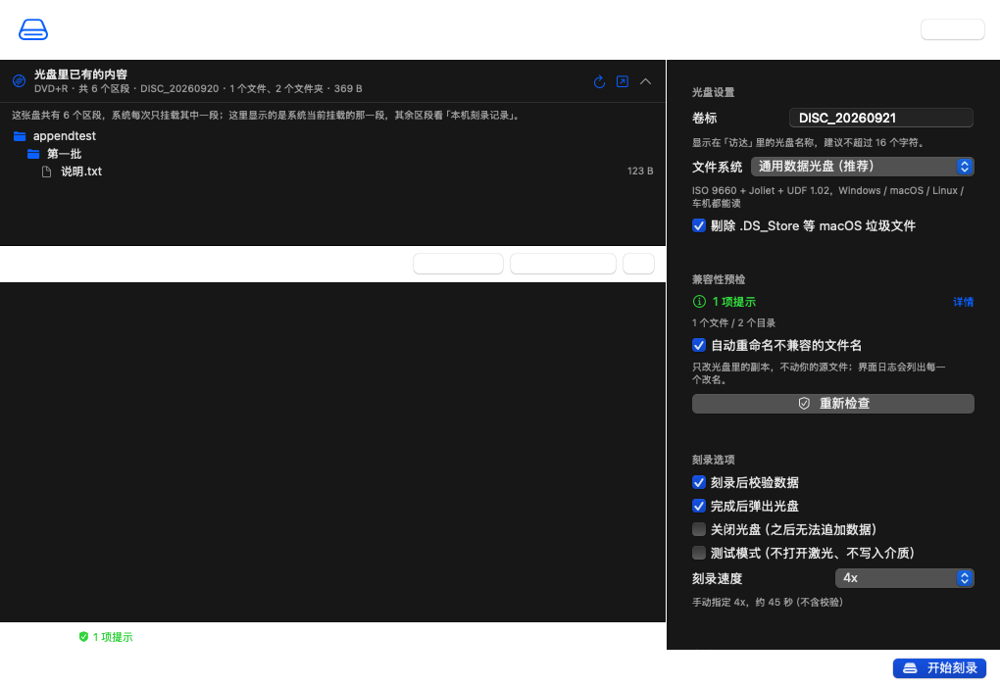
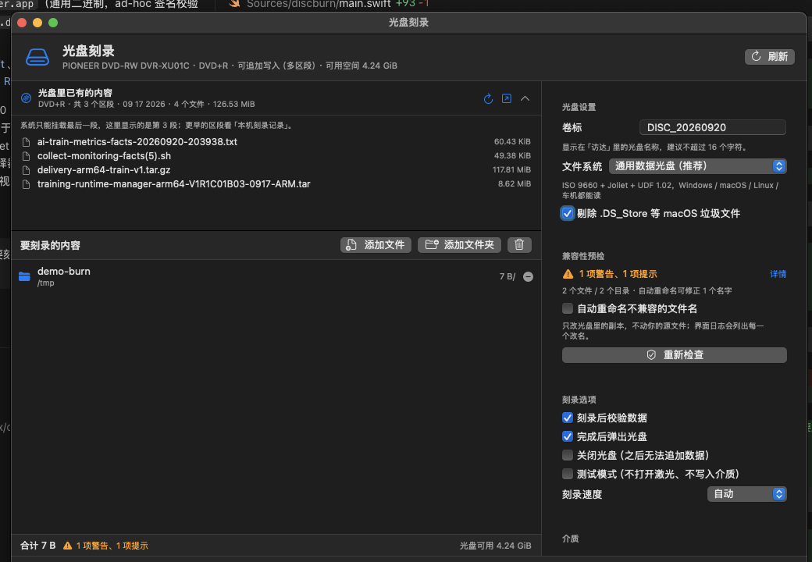
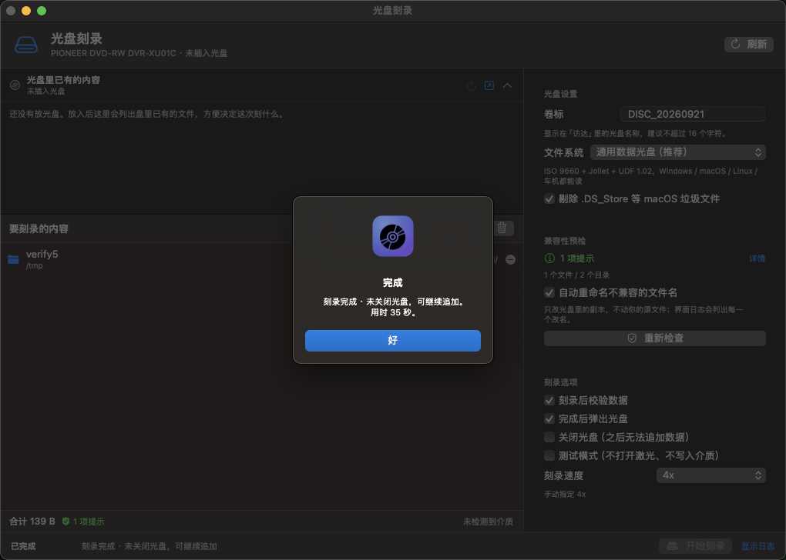
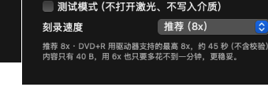
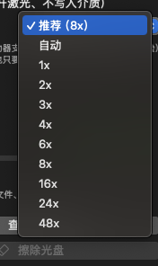
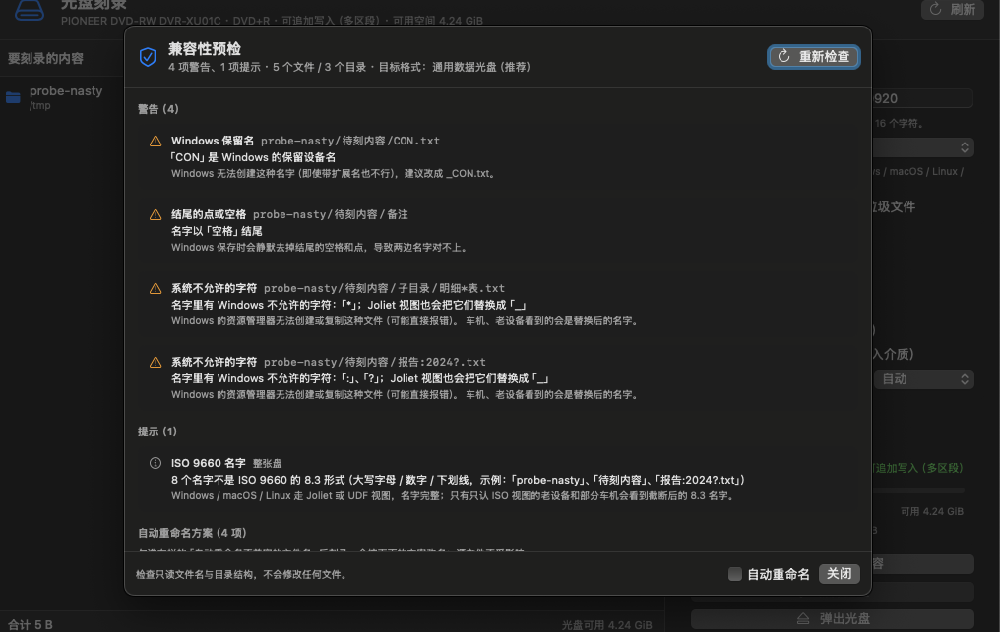
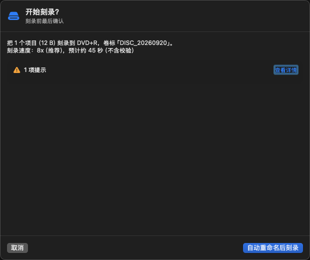

# 光盘刻录（DiscBurner）

在 macOS 上把**任意文件**刻录到 CD / DVD / 蓝光光盘的原生程序，支持外置 USB 光驱。
带图形界面（拖拽即可）和一个命令行工具，底层用 macOS 自带的 `drutil` 与 `hdiutil`，
不需要安装驱动、不需要 root 权限。



## 功能

- **拖拽刻录**：把文件或文件夹拖进窗口，点「开始刻录」即可；目录结构原样保留
- **已有文件列表**：左栏最上面就是这张盘里已经刻了什么（文件名、大小、区段数），不用先挂载到「访达」看
- **兼容性预检**：刻录前扫一遍文件名，提前发现 Windows 非法字符、保留名、超长名、大小写冲突等问题，可以一键自动重命名（只改光盘里的副本）
- **通用格式**：默认生成 `ISO 9660 + Joliet + UDF 1.02` 混合光盘，Windows / macOS / Linux / 车机都能读，中文文件名不乱码
- **刻录前预检**：自动读取光驱里的介质类型、剩余空间，内容超容量会直接拦住
- **数据校验**：刻录后默认逐字节校验（可关闭以节省时间）
- **推荐刻录速度**：按介质类型给一个稳妥的倍速（默认「推荐（8x）」），也能自己指定 1x / 2x / 3x / 4x / 6x / 8x / 16x / 24x / 48x；选项下面直接写着预计耗时
- **擦除可重写盘**：CD-RW / DVD-RW / DVD+RW / DVD-RAM / BD-RE
- **仅生成 ISO**：不想立刻刻盘时，先把内容打包成 `.iso` 存档
- **直接刻录现成映像**：把已有的 `.iso` / `.dmg` / `.cdr` / `.cue` / `.toc` 直接写给光驱
- **测试模式**：不写入介质，先完整跑一遍流程（`--test` / 界面上的测试刻录）。
  注意：能不能模拟刻录由驱动器和介质决定，本机这台先锋 DVR-XU01C 会直接回
  「该光盘与操作的类型不符」，所以真机上测试不了，只能靠低速 + 校验来降风险
- **可追加**：默认刻完**不关闭光盘**，同一张 DVD±R / BD-R 可以分多次刻，刻完会告诉你还剩多少空间
- **自动清理痕迹**：刻录前剔除 `.DS_Store`、`._*` 等 macOS 垃圾文件，避免它们出现在光盘里

## 快速开始

```bash
cd /Users/felix/code/recode
./build.sh                 # 编译 + 打包（不需要 Xcode，只用 Command Line Tools）
open dist/DiscBurner.app   # 打开图形界面
```

命令行工具在 `.build-manual/universal/discburn`，可以先自检：

```bash
./.build-manual/universal/discburn-selftest   # 262 项单元/集成自检
```

## 安装与分发

不想自己编译的话，直接去 **[Releases](https://github.com/hffdiss/discburner/releases)** 下最新的
`DiscBurner-<版本>.dmg`，打开后把「光盘刻录」拖进「应用程序」就行；
`DiscBurner-<版本>.zip` 是解压即用的版本。当前版本 **1.0.0**。

`./build.sh` 会产出三样东西：

| 产物 | 说明 |
| --- | --- |
| `dist/DiscBurner.app` | 可执行的应用包（Intel + Apple Silicon 通用二进制） |
| `dist/DiscBurner-<版本>.dmg` | 安装镜像：打开后把 App 拖进「应用程序」即可 |
| `dist/DiscBurner-<版本>.zip` | 压缩包，解压即用 |

版本号的唯一出处是仓库根的 `VERSION` 文件（目前 `1.0.0`），构建时会写进
`Info.plist` 的 `CFBundleShortVersionString`、App 的「关于」面板和产物文件名。

App 包内已经包含：

- `Contents/MacOS/DiscBurner` —— 图形界面（通用二进制）
- `Contents/MacOS/discburn` —— 同一套命令行工具，随 App 分发
- `Contents/Resources/AppIcon.icns`、`Info.plist`、`PkgInfo`、`zh-Hans.lproj` 本地化
- ad-hoc 签名（`codesign --verify --deep --strict` 通过）

在 App 里选「帮助 → 在访达中显示命令行工具」，就能看到内置工具的位置，
可以直接软链到你自己的 `PATH`：

```bash
ln -s /Applications/DiscBurner.app/Contents/MacOS/discburn /usr/local/bin/discburn
```

### 关于 Gatekeeper

本项目没有 Apple 开发者证书（`security find-identity -p codesigning` 显示 0 个身份），
所以只能 ad-hoc 签名、无法公证（notarize）。把 App 拷到**别人的** Mac 上第一次打开时，
系统可能提示「无法验证开发者」，任选一种方式放行：

1. 右键点 App → 「打开」→ 再点一次「打开」
2. 或者 `xattr -dr com.apple.quarantine /Applications/DiscBurner.app`
3. 或者在「系统设置 → 隐私与安全性」里点「仍要打开」

本机没这个问题（当前 Gatekeeper 是关闭状态）。想消除提示需要 Apple Developer 账号
（99 美元/年）做 Developer ID 签名 + 公证，构建脚本里换掉签名那一步即可。

### 构建选项

```bash
./build.sh                    # 默认：x86_64 + arm64 通用二进制 + DMG + ZIP
ARCHS=x86_64 ./build.sh       # 只编当前架构，快一倍
./build.sh --no-package       # 只构建 App，不生成 DMG/ZIP
VERSION=1.2.3 ./build.sh      # 临时指定版本号（不改 VERSION 文件）
```

### 发新版本

版本号用 `X.Y.Z`；发版一条命令，构建、自检、打 tag、上传 Release 一气呵成：

```bash
./Tools/release.sh patch "修了追加写"    # 1.0.0 → 1.0.1，说明写进发布正文
./Tools/release.sh minor                # 1.0.1 → 1.1.0
./Tools/release.sh 2.0.0                # 直接指定
./Tools/release.sh patch --draft        # 先发成草稿，检查完再在网页上发布
```

脚本会依次做这些事（任一步失败就停下，不会发半个版本出去）：

1. 检查工作区是否干净、这个 tag 有没有用过、GitHub 凭据能不能访问仓库
2. 用新版本号跑 `./build.sh`（产物是 `dist/DiscBurner-<版本>.dmg` / `.zip`）
3. 跑 262 项自检，不过不发版
4. 把版本号写回 `VERSION`、提交、打 `vX.Y.Z` tag 并推送（`main` 由 post-commit 钩子推）
5. 调 GitHub API 建 Release，把 `.dmg` 和 `.zip` 作为附件传上去

发布说明默认自动生成（列出上一个 tag 以来的提交 + 自检结果 + 安装步骤），
也可以用 `--notes "..."` 或 `--notes-file 文件` 覆盖。
凭据默认取 git 的 credential helper（本机存在 `~/.git-credentials`），
也可以用 `GITHUB_TOKEN=xxx ./Tools/release.sh ...` 临时指定。

只想看效果不想真发：加 `--dry-run`，它会把构建、自检和发布说明都跑一遍就停手。

## 图形界面

### 先看盘里有什么

左栏最上面是**「光盘里已有的内容」**，插入光盘后自动读取，列出盘里已有的文件和文件夹
（带大小），一眼就能看出这次还剩多少空间、要不要接着刻：



这一栏可以收起（标题栏右侧的 `⌃`），中间的分隔线可以上下拖动调整高度；
点标题栏的 ↑ 按钮或菜单「文件 → 查看光盘内容…」（`⌘I`）会打开完整窗口。
命令行等价命令是 `discburn contents`。

有两点必须说清楚：

- **多区段光盘上，macOS 每次只会挂载其中一段**（通常是最新一段，但不保证），Finder 里看到的也是它，
  程序能读的就是这一层，所以界面会写明「共 N 个区段（此处为系统挂载的那一段）」。
- 程序同时维护本机刻录记录（`~/Library/Application Support/DiscBurner/history.json`），
  记录每张盘刻过的卷标、文件数、大小和顶层项目，用来回溯更早的区段。

光盘没有被系统自动挂载时（例如区段未关闭），窗口里会出现「临时挂载并读取」按钮，
读取完自动弹出，不会在 Finder 里留下多余的卷。

如果这一栏一直显示「正在读取…」，多半是系统在等你授权：第一次用 App 读光盘时，
macOS 会弹出「DiscBurner.app 想访问可移除宗卷上的文件」，选「允许」即可。

### 操作流程

1. 接上外置光驱，放入空白光盘（CD-R/RW、DVD±R/RW、BD-R/RE）
2. 瞄一眼左栏最上面的「光盘里已有的内容」，确认这张盘的现状（空白盘会写明是空白）
3. 把要刻的文件/文件夹拖进下面「要刻录的内容」，或点「添加文件 / 添加文件夹」
4. 看右栏的兼容性预检有没有要处理的文件名
5. 改卷标（光盘在「访达」里显示的名字）和刻录选项（可选）
6. 点「开始刻录」（右栏底部和窗口右下角各有一个，`⌘↩` 也行）→ 确认 → 等进度条走完，光盘会自动弹出

刻完会直接告诉你这张盘还能不能再刻：弹窗和底部状态栏都写「刻录完成 · 光盘仍可继续追加，还剩 X」
或「刻录完成 · 未关闭光盘，可继续追加」。



右栏底部可以「擦除光盘」和「弹出光盘」；擦除是不可恢复操作，会二次确认。

### 刻录速度怎么选

速度不是越快越好：一次写入介质写坏了这张盘就废了，所以默认给的是**推荐**值 —— 按当前介质类型取的稳妥档：

| 介质 | 稳妥上限 | 驱动器没上报能力时用 |
| --- | --- | --- |
| CD-R | 24x | 16x |
| CD-RW | 10x | 8x |
| DVD±R | 8x | 8x |
| DVD±R DL（双层） | 4x | 4x |
| DVD±RW | 6x | 4x |
| DVD-RAM | 3x | 2x |
| BD-R | 4x | 4x |
| BD-RE | 2x | 2x |

挑法：驱动器上报了可写倍速，就从里面选「不超过上限的最高一档」；没上报（不少 USB 光驱不报，
实测这台 PIONEER DVD-RW DVR-XU01C 对 DVD+R 就不报）就用表里右列的常用值。
选项下面那行会写明**为什么是这个值**以及**大概要刻多久**（按内容大小换算）：



下拉框的顺序是「推荐（8x）」（默认，括号里是当前盘的建议值）、「自动」（完全交给 `drutil` 决定），
然后是 1x / 2x / 3x / 4x / 6x / 8x / 16x / 24x / 48x 九档固定值，随时可以改：



如果这张盘的稳妥上限比「推荐」值还低（例如 DVD+R DL 上限 4x、DVD+RW 6x、BD-RE 2x），
而你又往上选了一档，说明行会变成橙色，明确写清代价：`8x 高于 4x 的稳妥上限：一次性写入介质上刻坏只能换盘。`
选了驱动器没上报的档位（例如在只报 3/4/6/8x 的 DVD+R 上选 48x），还会再加一句
`驱动器上报的倍速是 3x / 4x / 6x / 8x，没有 48x：可能被直接拒绝。`
命令行接受任意数字，超上限时同样会警告：

```text
$ discburn plan ~/资料 --speed 16
  刻录速度：16x（手动指定），预计约 45 秒 · ⚠︎ 16x 高于 8x 的稳妥上限：一次性写入介质上刻坏只能换盘。
```

命令行同理：`--speed` 不给就是 `recommended`，`discburn plan` 会把推荐值、理由和预计耗时一起打印出来。

### 兼容性预检

文件名在不同系统上的规矩不一样，光是「刻进去了」，不等于「别的机器能读」。所以添加完内容后，
程序会自动扫一遍（左栏底部和右栏都有状态，`⌘K` 看详情）：



检查的内容：

| 类别 | 例子 | 后果 | 严重度 |
| --- | --- | --- | --- |
| 系统不允许的字符 | `报告:2024?.txt` | Windows 无法创建 / 复制，Joliet 视图会替换成 `_` | 警告 |
| Windows 保留名 | `CON.txt`、`lpt9` | Windows 直接拒绝这种名字（带扩展名也一样） | 警告 |
| 结尾的点或空格 | `备注 ` | Windows 保存时静默丢掉，两边名字对不上 | 警告 |
| 名字过长 | 超过 255 字节 / 超过 Joliet 的 64 字符 | Linux、APFS 放不下；车机只会显示前 64 个字符 | 需处理 / 警告 |
| 大小写冲突 | 同一目录下 `Report.txt` 与 `report.txt` | Windows 与大小写不敏感的磁盘分不清，整理文件时直接失败 | 需处理 |
| Unicode 重名 | `café` 的两种写法 | HFS+ / Windows 视为同一个名字，可能互相覆盖 | 警告 |
| 目录层级过深 | 超过 8 层 | 只认 ISO 视图的老设备看不到深层内容 | 警告 |
| 符号链接 | 任何软链接 | Windows 上失效；UDF 视图里 macOS 也读不到链接目标 | 警告 |
| ISO 8.3 名字 | 任何中文 / 长文件名 | Windows / macOS / Linux 走 Joliet 或 UDF 视图不受影响；只认 ISO 的老设备会看到截断名 | 提示 |

点「开始刻录」时会弹确认单，按预检结果给出三个选择：



- **自动重命名后刻录**（推荐）：把 `报告:2024?.txt` 改成 `报告_2024_.txt`、`CON.txt` 改成 `_CON.txt`、
  同名冲突加序号。**只改光盘里的副本，磁盘上的源文件一个都不动**，日志里会逐条列出改了什么。
- **保留原名刻录**：名字原样写进光盘（有「需处理」的问题时可能失败，失败会说明原因）。
- **取消**：回去自己改名或调整内容。

预检是只读的，不改任何文件；命令行同样能用：`discburn check <路径…>` 看清单，刻录时加 `--fix-names` 自动改名。

菜单栏快捷键：

| 快捷键 | 动作 |
| --- | --- |
| `⌘O` / `⇧⌘O` | 添加文件 / 添加文件夹 |
| `⌘↩` | 开始刻录 |
| `⇧⌘S` | 生成 ISO 映像 |
| `⌘E` | 弹出光盘 |
| `⌘I` | 查看光盘内容 |
| `⌘K` | 兼容性预检详情 |
| `⌘R` | 刷新光驱状态 |
| `⌘L` | 显示 / 隐藏日志 |

### 刻好的盘拿到 Windows / Linux 上怎么用

默认的「通用数据光盘」是 **ISO 9660 + Joliet + UDF 1.02** 三合一，同一个卷里放了多套目录表，
谁认得哪套就用哪套，所以三个系统都能读到同样的文件和中文名：

| 系统 | 读的是哪套 | 实际表现 |
| --- | --- | --- |
| Windows 7 及以后 | Joliet（或 UDF） | 资源管理器直接打开，中文名、长文件名正常 |
| Linux | UDF（内核自带 `udf`），没有就退到 `isofs`/Joliet | `mount /dev/sr0 /mnt` 即可，不需要装驱动 |
| macOS | UDF | 插入即挂载 |
| 车机 / 老播放器 / 老刻录机 | 只认 ISO 9660 时看到 8.3 大写名 | 这就是「名字太长」被标成警告的原因 |

几个容易被忽略的点：

- **多区段盘别直接给别人**：Windows 与 Linux 和 macOS 一样，通常只挂载光盘的**其中一个**区段，
  看不到前面刻过的内容。要交给别人用，就在一次刻录里把内容凑齐，并勾上「关闭光盘」。
  Linux 上想翻旧区段，可以 `dd` 把整盘抽成映像再用 `isoinfo -i disc.iso -R` 逐段看。
- **擦除过的可重写盘**（DVD-RW / BD-RE）在某些 Windows 版本上要重新格式化才能写，
  程序擦除后直接刻录是不需要这一步的。
- 刻录后默认逐字节校验，读盘不通过的盘会被标出来，别拿它去归档。

## 命令行

```bash
discburn list                              # 列出光驱 + 当前介质状态
discburn status                            # 介质详情（容量、区段、倍速、能否擦除）
discburn contents                          # 读取光盘里已有的内容
discburn contents --image ~/x.iso          # 读取光盘映像里的内容
discburn history                           # 本机刻过什么
discburn plan ~/Movies ~/a.pdf --name 存档  # 只估算大小，不写盘
discburn check ~/Documents                 # 兼容性预检（Windows / Linux / 老设备）

# 刻录
discburn burn ~/Movies/婚礼 ~/Documents/合同.pdf --name 婚礼存档
discburn burn ~/Desktop/backup.iso         # 直接刻录现成映像
discburn burn ~/Pictures --test            # 测试模式：跑流程但不写盘
discburn burn ~/Documents --fix-names      # 自动重命名不兼容的文件名后再刻

# 其它
discburn image ~/Pictures -o ~/Desktop/照片.iso   # 只生成 ISO
discburn erase --mode quick                       # 擦除（会要求输入 yes）
discburn eject
```

常用选项：

| 选项 | 说明 |
| --- | --- |
| `--name <卷标>` | 光盘卷标，默认 `DISC_日期` |
| `--speed <N\|auto\|recommended>` | 刻录倍速，默认 `recommended`（按介质给的稳妥值，见下节表格） |
| `--drive <N>` | 指定驱动器编号（见 `discburn list`） |
| `--no-verify` | 刻录后不校验（快一些） |
| `--no-eject` | 刻完不弹出 |
| `--test` | 测试刻录，不打开激光 |
| `--erase-first` | 刻之前先快速擦除（仅可重写盘） |
| `--close` | 刻完关闭光盘（默认不关，可继续追加） |
| `--fix-names` | 自动重命名不兼容的文件名（只改光盘里的副本） |
| `--strict` | 有「需处理」的兼容性问题就中止，不开始刻录 |
| `--json` | 仅 `check` 命令：以 JSON 输出预检结果 |
| `--force` | 忽略容量检查，强行尝试 |
| `--keep` | 保留临时目录，便于排错 |

## 它内部做了什么

```text
选中的文件/文件夹
      │  ⓪ 兼容性预检：扫一遍名字（Windows 非法字符 / 保留名 / 大小写冲突 / 超长名…）
      │  ① 复制（APFS 同卷时用 clonefile 写时复制，几乎瞬时、不占额外空间）
      ▼
临时暂存目录  ── 剔除 .DS_Store / ._* 等垃圾文件，按需自动重命名 + 处理重名
      │  ② hdiutil makehybrid -iso -joliet -udf -udf-version 1.02
      ▼
光盘映像 .iso（先 -print-size 估算容量，与光盘剩余空间比对）
      │  ③ drutil burn -speed N (-appendable|-noappendable) (-verify|-noverify) <iso>
      ▼
光盘  ── 可选：drutil 校验 → drutil eject 弹出
```

预检的规则不是拍脑袋定的，而是和文件系统选项绑在一起的（见 `ImageOptions.nameRules`）：
选了「纯 UDF」就不会再报 Joliet 的 64 字符问题，同时带 UDF 时自动重命名也不会把名字截断到 64 字符。

- 介质/光驱信息来自 `drutil list`、`drutil status`、`drutil discinfo`
- 擦除用 `drutil erase quick|full`
- 所有命令都通过 `Process` 调用，实时输出被解析成「阶段 + 百分比」显示在进度条上

## 容量参考

| 介质 | 标称容量 |
| --- | --- |
| CD-R / CD-RW | 703 MiB |
| DVD±R / DVD±RW / DVD-RAM | 4.38 GiB |
| DVD±R 双层 | 7.96 GiB |
| BD-R / BD-RE（单层） | 23.3 GiB |
| BD-R / BD-RE（双层） | 46.6 GiB |

程序优先用驱动器上报的**真实剩余空间**判断，标称值只用于没有介质时的建议。

## 常见问题

**`drutil list` 显示 SupportLevel 是 Unsupported，还能刻吗？**
能。第三方 USB 光驱（先锋、LG、华硕等）几乎都是这个状态，它只表示 Apple 没有登记该型号的写入策略表。实际刻录由 `hdiutil` 完成，可以正常工作。

**需要 sudo 吗？**
不需要。

**第一次打开时弹出「想访问可移除宗卷上的文件」，是必须的吗？**
是。要列出光盘里已有的内容、读取剩余空间、刻完做校验，都需要读光驱里的那张盘。
选「允许」之后就不会再问。如果误点了「不允许」，去「系统设置 → 隐私与安全性 → 文件与文件夹」
里把「光盘刻录」的「可移除宗卷」重新勾上即可。

**光盘刻到一半会不会刻废？**
一次写入介质（CD-R、DVD±R、BD-R）刻坏会浪费一张盘。降低风险的顺序是：
先用 `--speed 4` 这类低倍速真刻；**测试模式只是「不写入」的模拟**，很多 USB 光驱
（包括本机这台先锋）根本不支持，跑不起来不代表刻录有问题。刻完之后默认会**不关闭光盘**，
所以即使这一段的目录写得不好，也不能回退重来——检查内容是刻录前的活。

**为什么刻完还能再刻一次？**
因为程序默认用 `drutil burn -appendable`，刻完**不给光盘收尾**。DVD±R / BD-R 是多区段介质，
每次刻录写一个新区段，系统读盘时看到的是最近挂载的那一段，同一张盘能分多次追加，
界面和命令行都会在刻完后告诉你「光盘仍可继续追加，还剩 X」。

想一次写完、把盘封死（例如要送去压制母盘、或给老设备用），勾上「刻完关闭光盘」
或加 `--close`；关掉之后这张盘就再也追加不了内容了。

**为什么追加后只看到最后一段？**
多区段光盘在 macOS 上每次只会挂载其中一段（通常是新刻的那段），更早的区段系统层面不显示，
这是系统行为而不是刻录出错。想看这张盘一共刻过什么，看左栏的区段数，或 `discburn history` 的本机记录。

**`hdiutil burn` 和 `drutil burn` 有什么区别？**
早期版本用 `hdiutil burn`，实测即使加 `-noforceclose` 也会把 DVD+R 收尾（刻完 `Space Free: 0`、
`discStatus: 2`），追加不了。现在统一走 `drutil burn`，`-appendable` / `-noappendable` 真正生效。

**为什么默认不选最快速度？**
因为刻录速度越高，写入出错、刻废这张盘的几率越大，而 CD-R / DVD±R / BD-R 只能写一次。
反过来说，退回低速也亏不了多少时间：刻满一张 4.7 GB 的 DVD，8x 大约 7 分钟，
4x 大约 14 分钟，差的那几分钟远小于废一张盘的成本。所以默认是「按介质给的稳妥档」；
等连着刻了几张都稳，再在同一个下拉框里往上加。

**可以刻音乐 CD / DVD 影碟吗？**
当前版本专注**数据光盘**（任意文件）。音乐 CD 需要 `drutil burn -audio` 与红皮书格式，视频 DVD 需要 UDF 1.02 的 VIDEO_TS 结构，都还没有实现。

**为什么有些文件在 Windows 上打不开 / 名字变了？**
多半是文件名的锅：`:`、`?`、`*`、`"`、`<`、`>`、`|`、`\` 在 Windows 上非法，`CON`、`NUL`、`COM1` 这类是保留设备名，
名字结尾的空格和点会被 Windows 丢掉，超过 64 个字符的名字在 Joliet 视图里会被截断。
界面上的**兼容性预检**会把这些问题一次列清楚，点「自动重命名后刻录」即可（源文件不受影响）。

**大小写冲突为什么要「需处理」？**
`Report.txt` 和 `report.txt` 在大小写敏感的磁盘（大小写敏感格式化的 APFS、ext4）上可以共存，
但 Windows 和默认的 macOS 磁盘只会保留一个。刻录前整理文件要先把它们复制到同一个临时目录，
在大小写不敏感的卷上这一步就会失败——所以预检把它算作「需处理」，自动重命名会改成 `Report 2.txt` 这类唯一名字。

**我是 Apple Silicon 怎么办？**
`build.sh` 会用本机工具链编译当前架构，M 系列芯片直接可用（本机验证的是 Intel + macOS 15）。

**为什么不能 `swift build`？**
这台机器的 `swift build`（SwiftPM 5.4，且只装了 Command Line Tools）会因为没有 `xctest` 而失败，属于工具链问题，和本项目无关。`Package.swift` 仍然保留，装了完整 Xcode 的机器可以正常 `swift build` / `swift test`。所以本机请用 `./build.sh`。

## 已验证 / 未验证

已验证（本机 macOS 15.7.9 + PIONEER DVD-RW DVR-XU01C 外置光驱）：

- 光驱枚举与介质状态解析（介质类型、剩余空间、区段、倍速、可擦除标记）
- 中文文件名、目录结构、垃圾文件剔除在生成的映像里全部正确
- 兼容性预检：非法字符 / Windows 保留名 / 结尾空格 / 超长名 / 目录层级 / 符号链接 / Unicode 重名在真实目录上都能识别；
  在**大小写敏感的 APFS 卷**上用 `Report.txt`、`report.txt`、`RepoRT.txt` 复现了「保留原名会失败」与「自动重命名后三个文件都完整保存」
- 左栏「光盘里已有的内容」：插入光盘后自动列出盘内文件（实测读出盘里的 4 个文件与卷标），
  收起 / 展开与拖动分隔线正常；未插盘、空白盘、未挂载（显示「临时挂载并读取」）三种状态都有对应提示
- 刻录速度建议：按介质给稳妥档（这台盘是 DVD+R → 推荐 8x，并写明「驱动器没有上报倍速，按常用值取 8x」），
  下拉框可改「自动」或 1x / 2x / 3x / 4x / 6x / 8x / 16x / 24x / 48x；说明行会随选择变（换档后提示「手动指定 8x，约 45 秒」）；预计耗时按内容大小换算
- `hdiutil makehybrid` 生成映像、`drutil burn` 真实写盘、`drutil erase/eject` 参数拼装
- 命令行与图形界面均能构建、运行；262 项自检全部通过（含速度建议、常用档位与耗时换算三组）
- 通用二进制（x86_64 + arm64）、App 包结构、ad-hoc 签名校验、DMG 挂载后直接运行
- 光盘写满/被关闭后 `Writability` 字段为空的情况（改用 `discinfo` 的 Disc Status 判断，不再误报「状态未知」）
- **真实刻录**：同一张 DVD+R 上连续追加 7 段全部成功（含最后两次从图形界面点「开始刻录」的完整流程），
  每段挂载后内容与卷标核对无误，刻完仍可继续追加（详见上面的「真实刻录与追加写验证」）
- 「临时挂载并读取」：物理光驱不允许自定义挂载点，改为让系统挂到 `/Volumes` 下读完再按设备节点卸载
  （真机验证：先 `diskutil unmount` 把盘卸下来，程序能自己挂载读完内容，读完 `/Volumes` 里不留残留卷）
- 刻录完成后会把「这张盘还能不能再刻」写在状态栏和弹窗里（`刻录完成 · 光盘仍可继续追加，还剩 X`），
  「开始刻录」按钮也放到了底部状态栏，窗口再矮也不会被滚动区藏起来
- 未连接光驱时的降级行为：界面提示「未检测到光驱」，命令行给出明确错误而不是假成功


### 真实刻录与追加写验证（2026-09-20）

真机写入已经跑通，过程中查清了一个关键问题：

- **`hdiutil burn` 会把盘收尾**：即使带上 `-noforceclose`，实测刻完 `Writability` 变空、
  `Space Free: 0`、`discStatus: 2`、`sessionState: 3`，也就是这张 DVD+R 不能再追加。
  所以刻录后端已经**换成 `drutil burn`**，`-appendable` / `-noappendable` 才真正生效。
- **`drutil burn -appendable` 追加正常**：同一张 DVD+R 连续刻了 7 段，每段刻完
  `discStatus` 都是 1、`Writability: appendable`、剩余空间逐段递减；其中 6 段由本 App 写入，
  最后两段是从图形界面点「开始刻录」跑完的完整流程（5 段 → 6 段 → 7 段，仍可继续追加）。
- **刻完那句话能送到人眼前**：完成后弹窗直接写「刻录完成 · 未关闭光盘，可继续追加」，底部状态栏也留着同一句，
  不会再被笼统的「刻录完成」覆盖掉。
- 每一段都是独立的 `ISO 9660 + Joliet + UDF 1.02` 卷，挂载后逐字核对内容正确，中文名正常。
- 这台先锋 DVR-XU01C **不支持模拟刻录**：`drutil burn -test` 和 `hdiutil burn -testburn`
  都返回「该光盘与操作的类型不符」，所以界面里的「测试模式」在本机跑不起来，只能真刻。
- 驱动器偶尔在刻完后短暂「认不到盘」（`drutil status` 报 No Media Inserted）。程序会自动重试 3 次；
  仍然读不到时，把盘弹出再放回去就恢复，盘上的数据不受影响。

> 补充：从 App 包（而不是命令行）第一次读取光盘时，macOS 会要求授权访问可移除宗卷，
> 这是系统行为，Info.plist 里已经写好用途说明；本机验证时授权过一次，之后不再询问。

## 项目结构

```text
Sources/DiscBurnKit/        # 核心库：驱动检测、暂存、映像生成、刻录/擦除
  ├─ Shell.swift            # 进程调用封装（流式输出 + 可取消）
  ├─ Media.swift            # 介质类型、容量、写入状态
  ├─ DriveService.swift     # drutil 解析（list / status / discinfo）
  ├─ Workspace.swift        # 暂存目录、clonefile 加速、垃圾文件清理
  ├─ Compatibility.swift    # 兼容性预检（非法字符 / 保留名 / 冲突 / 超长名）与自动重命名
  ├─ ImageBuilder.swift     # hdiutil makehybrid 封装
  ├─ Burner.swift           # drutil burn / drutil erase 封装 + 进度推算 + 输出清洗
  └─ BurnJob.swift          # 端到端任务编排
Sources/discburn/           # 命令行工具
Sources/DiscBurnerApp/      # SwiftUI 图形界面
Sources/DiscBurnSelfTest/   # 自检程序
Tools/make_icon.swift       # 生成 App 图标
Tools/sync.sh               # 改完之后：跑自检 → 提交 → 推送到 GitHub
build.sh                    # 一键构建 + 打包 .app
AGENTS.md                   # 项目约定（中文、构建方式、真机注意事项）
```

改完代码想直接同步到远端：

```bash
./Tools/sync.sh "这次改了什么" --test   # 先跑自检，过了才提交并推送到 origin/main
```

每次 `git commit` 之后，`.git/hooks/post-commit` 也会自动把 `main` 推到
`github.com/hffdiss/discburner`（结果记在 `.git/post-commit-push.log`，失败不影响提交）。

## 免责声明

刻录和擦除都会真实改动光盘内容：擦除不可恢复，一次写入介质刻坏只能换盘。
程序会在擦除前要求确认，并默认不关闭光盘（可继续追加），请自行确认目标光盘再操作。
